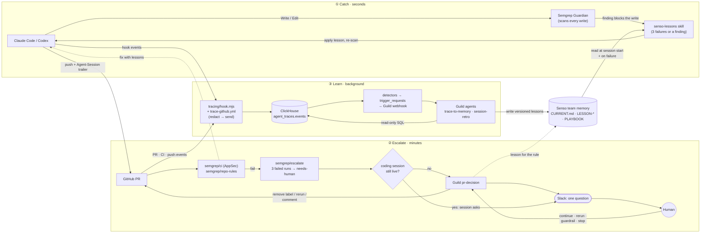

# token-wise

**token-wise gives a team's coding agents a shared memory: it catches security mistakes as they're written, stops retry loops by handing off to a human after three failures, and turns every traced failure into a lesson the next agent reads, so no agent makes the same mistake twice.**

> *Fail once. Ask the team. Never twice.*

## Why this exists

Every coding-agent session starts with no memory of the ones before it. When an agent hits a problem a teammate's agent solved yesterday, it doesn't know. So it retries: rewrites the call, changes a flag, tries again. Each retry burns tokens and CI minutes, and a security mistake fixed once gets written again in the next session.

The usual tools each solve one piece:
- **Scanners** find the problem but don't teach the agent how this team fixes it.
- **Memory stores** hold knowledge but don't step in at the moment an agent fails.
- **Human review** either interrupts constantly or arrives after the damage.

token-wise connects these pieces into one loop. A failure is **caught**, matched to a **team lesson** right when it happens, **sent to a human** with full context when the agent is stuck, and finally **turned into a new lesson** for the next agent. Every step leaves a record in ClickHouse, so it can be audited and measured.

## What it does: three loops, three speeds

| Loop | Speed | What happens | Built with |
|---|---|---|---|
| **1 · Catch** | seconds, on every file write | Semgrep Guardian scans each write and blocks findings. The agent follows the `senso-lessons` skill: after a finding, or after 3 failures of the same goal, it looks up the team's lesson in Senso before trying again, then logs that it used it (`context_injected`). | Semgrep Guardian, Senso, `.claude/skills/senso-lessons` |
| **2 · Escalate** | minutes, on every PR | `semgrep/ci` (Semgrep AppSec Platform) and `semgrep/repo-rules` (our own rules in `.semgrep/rules/`) scan each PR. The agent downloads findings and fixes them using Senso lessons. After **3 failed runs** on a branch, `semgrep/escalate` labels the PR `needs-human`, and agents stop pushing. The human is then asked **one question** in Slack, either by the live coding session or by the Guild `pr-decision` agent. They answer `continue`, `rerun`, `guardrail: <change>` or `stop`, and the agent acts on it. | Semgrep AppSec, GitHub Actions, Guild, Slack, `policies/pr-decision/POLICY.md` |
| **3 · Learn** | in the background | Hooks trace every prompt, tool call, Semgrep result, push, PR and CI run into ClickHouse, with secrets redacted first. Detectors in ClickHouse notice patterns (a session ended, a failure repeated) and start a Guild agent through a webhook. The agent reads the traces and writes versioned `LESSON-*` / PLAYBOOK docs into Senso, which loop 1 reads next time. | ClickHouse, Guild (`trace-to-memory`, `session-retro`), Senso |

Shared rules every agent follows (Claude Code and Codex) live in `AGENTS.md`: read `CURRENT.md` at session start, update it at every task boundary, never overwrite an idea doc (save V1, V2, …), and label every number as measured, fixture or guessed.



## How the pieces connect

| Link | Mechanism |
|---|---|
| Agent → Semgrep | Guardian plugin hook scans every file write and blocks on findings |
| Agent → Senso | `senso-lessons` skill: free folder listing → exact `LESSON-semgrep-<rule>` lookup or a folder-scoped `senso search context`; use is logged with `node tracing/hook.mjs context-injected --lesson-id <id>` |
| PR → Semgrep | `.github/workflows/semgrep.yml`: `semgrep ci` (AppSec, `SEMGREP_APP_TOKEN`) + `semgrep scan --config .semgrep/rules --error`; findings uploaded as artifacts for the agent |
| Semgrep → human | `semgrep/escalate` counts failed runs on the branch; at 3 it labels `needs-human`, `tracing/route-escalation.mjs` picks the asker (live session by its `Agent-Session:` trailer, else Guild), and the Guild `pr-decision` agent is started via its API trigger (`GUILD_PR_DECISION_KEY`) |
| Slack → Guild → PR | The `pr-decision-slack-reply` webhook trigger runs the agent on a thread reply; it applies the decision on the PR (remove label, re-run, or keep) and confirms in the thread |
| Agent → ClickHouse | Hooks in `.claude/settings.json` / `.codex/hooks.json` run `tracing/hook.mjs`: redacts secrets, inserts rows, spools to `.trace/` when offline |
| Semgrep → ClickHouse | Guardian results are read from the Claude transcript and stored as `semgrep_scan` rows, keyed to the tool call |
| GitHub → ClickHouse | `.github/workflows/trace-github.yml` logs PR, CI, and push events; the `Agent-Session:` commit trailer links them to sessions |
| ClickHouse → Guild | Detectors (`tracing/triggers.sql`) append rows to `agent_traces.trigger_requests`; each row is POSTed to the Guild API trigger of the agent named in its `agent` column (`tracing/webhook.sql`) |
| Guild → Senso | `trace-to-memory` queries traces (read-only) and writes `LESSON-*` docs + the `## Lessons` section of `CURRENT.md` |
| Senso → Agents | `AGENTS.md` tells every agent to read `CURRENT.md` at session start |

## Status and what we're doing now

**Working end to end (verified 2026-10-09):**
- Guardian + `senso-lessons` lookup.
- Semgrep AppSec and repo-rule PR checks.
- The `needs-human` escalation, and the Slack round trip through Guild `pr-decision`. PR #4: Guild asked in Slack, the human replied `continue`, and the label was removed.
- ClickHouse tracing, plus the `session_end` → `session-retro` detector.

**Now: a 3-minute demo video.** It's built from real captured frames, not a live run, so each beat can be repeated on its own.
- `demo/PREREQ.md`: the setup checks and six beats (B1 catch → B6 first-try fix). Each beat lists a fixed starting input, what should happen, what evidence to save, and how to reset it.
- `demo/deck/index.html`: a 3:00 deck that plays itself, with the narration script built in. Each slide's length is set from its word count (314 words, which fits 3:00 at a slow 120 wpm). Open it in a browser: **P** plays the timeline, **S** opens a presenter window with the script, **N** shows a teleprompter bar, and `?record` hides all controls for capture. Captured frames go in each beat's `data-src`. B4 (Slack) is filled; B1–B3, B5 and B6 are still to record.

**Next:** record B2–B3 on `demo/pr-loop`. Then retake B4 so the Slack question shows real push counts and rule names; today's capture says "none found". Then B5 (manual trigger) and B6.

## ClickHouse: insights and triggers

ClickHouse does the analysis that decides **when** an agent runs and **what** it should look at. Agents get a
precomputed window and summary, so they spend fewer queries.

### Objects (`agent_traces`)

| Object | Engine | Role |
|---|---|---|
| `events` | `ReplacingMergeTree(inserted_at)`, `PARTITION BY toYYYYMM(ts)`, `ORDER BY (repo, session_id, ts, event_id)` | One row per traced event. Re-sent rows (spool retries) share an `event_id` and collapse |
| `trigger_requests` | `MergeTree` | One row = one agent run: `agent`, `dedup_key`, `window_start`/`window_end`, `context` JSON, `text` |
| `detect_*_mv` | Refreshable MV (`REFRESH EVERY … APPEND TO trigger_requests`) | Detectors: re-run a query on a schedule, append new triggers |
| `trigger_requests_mv` | Incremental MV | Fires on each insert into `trigger_requests`; sets `agent_id = '<owner>~' \|\| agent` and appends `' Context: ' \|\| context` to the text when a detector filled it |
| `guild_webhook` | `URL(…, JSONEachRow, headers(…))` | An `INSERT` becomes an HTTP POST to Guild (`session_type: api_trigger`, `agent_id`). One API trigger key starts any agent installed in the workspace |

Flow: `events` → detector (every 5 min) → `trigger_requests` → incremental MV → URL table → Guild run.
Verified 2026-10-09: rows appended by a refreshable MV do fire the downstream incremental MV.

### Rules every query follows
- **`FROM agent_traces.events FINAL`**: collapses re-sent rows before counting. Without it, counts can double.
- **Detectors are refreshable, not insert-time.** An insert-time MV sees only one `INSERT` block, so it can't
  count across a session, and a spool retry would fire it twice.
- **Dedup:** each detector builds a `dedup_key` (`session_end:<session>:<event_id>`) and skips keys already in
  `trigger_requests` (`HAVING dedup_key NOT IN (SELECT dedup_key FROM agent_traces.trigger_requests …)`).
- **Settle delay:** a detector only considers rows with `inserted_at < now64(3) - INTERVAL 2 MINUTE`, so async
  hook rows for the same session have landed first.
- **Lookback bound:** `inserted_at > now64(3) - INTERVAL 7 DAY` keeps each refresh cheap.
- **Late rows:** filter detectors on `inserted_at` (arrival), not `ts`. Spooled rows arrive later with an old `ts`.
- **Failed tool calls** are `event_type = 'tool_call' AND hook_event = 'PostToolUseFailure'`. They use the same
  type so call counts stay complete.

### Syntax used
| Need | ClickHouse syntax |
|---|---|
| Scheduled detector | `CREATE MATERIALIZED VIEW … REFRESH EVERY 5 MINUTE APPEND TO agent_traces.trigger_requests AS SELECT …` |
| Session segments (a resumed session ends twice) | `lagInFrame(ts, 1, toDateTime64(0, 3, 'UTC')) OVER (PARTITION BY session_id ORDER BY ts …)` |
| Per-session summary | `countIf(...)`, `sumIf(...)`, `anyLast(git_branch)`, `dateDiff('minute', start, end)` |
| Context payload | `toJSONString(map('tool_calls', toString(n), …))` |
| Per-rule Semgrep stats | `ARRAY JOIN semgrep_rules AS rule`, `groupUniqArray(10)(tool_use_id)`, `groupUniqArrayArray(10)(semgrep_files)` |
| Fields inside `payload` | `JSONExtractString(payload, 'conclusion')`, `JSONExtractBool(payload, 'forced')` |
| HTTP out | `ENGINE = URL('https://api.guild.ai/…/sessions', JSONEachRow, headers('Authorization' = 'Basic …'))` |
| Refresh health | `SELECT view, status, last_success_time, exception FROM system.view_refreshes` |

### Triggers

| Detector | Fires when | Agent | Status |
|---|---|---|---|
| `detect_session_end_mv` | a `session_end` with ≥ 5 tool calls in its segment | `session-retro` → PLAYBOOK docs | live (agent v1.0.0 published) |
| volume | a live session passes another N tool calls | `session-retro` | planned |
| thrash | same command / failing goal ≥ 3 times in 10 min | `loop-breaker` | planned |
| PR merged | `github_pr` closed + merged; context = linked sessions' calls since the agent's last run | `workflow-canonizer` → RUNBOOK (proposed) | planned |
| guardrail | new Semgrep finding / CI failure / force-push, debounced to 30 min | `trace-to-memory` → LESSON | planned (manual today) |

Design and decisions: Senso `DESIGN-agent-triggers-V1.md`.

## Commands

```bash
npm test                 # tracing tests
npm run trace:schema     # create agent_traces.events
npm run trace:webhook    # create trigger_requests + the ClickHouse → Guild webhook (recreates the routing MV)
npm run trace:triggers   # create the detector MVs in tracing/triggers.sql
```

Trigger the Guild agent manually (any ClickHouse client):

```sql
INSERT INTO agent_traces.trigger_requests (source, agent, text)
VALUES ('manual', 'trace-to-memory', 'Run rule lessons-from-failures for the last 24 hours.');
-- agent = any installed agent's name, e.g. 'session-retro'
```

Credentials live in `~/.config/oct9/` (`clickhouse.env`, `guild.env`), never in the repo. One Guild API trigger key
(`GUILD_TRIGGER_KEY`) serves every agent: the request's `agent_id` picks the agent, which must be published and
installed in the workspace (`guild workspace agent add owner~agent`).
