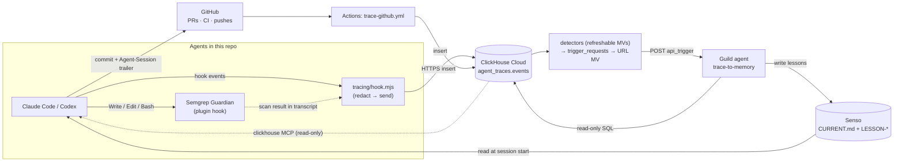

# oct_9

Coding agents (Claude Code, Codex) share one memory in Senso, get security-scanned by Semgrep Guardian, and every action is traced to ClickHouse. A Guild agent turns those traces back into memory.



## How the pieces connect

| Link | Mechanism |
|---|---|
| Agent → Semgrep | Guardian plugin hook scans every file write and blocks on findings |
| Agent → ClickHouse | Hooks in `.claude/settings.json` / `.codex/hooks.json` run `tracing/hook.mjs`: redacts secrets, inserts rows, spools to `.trace/` when offline |
| Semgrep → ClickHouse | Guardian results are read from the Claude transcript and stored as `semgrep_scan` rows, keyed to the tool call |
| GitHub → ClickHouse | `.github/workflows/trace-github.yml` logs PR, CI, and push events; the `Agent-Session:` commit trailer links them to sessions |
| ClickHouse → Guild | Detectors (`tracing/triggers.sql`) append rows to `agent_traces.trigger_requests`; each row is POSTed to the Guild API trigger of the agent named in its `agent` column (`tracing/webhook.sql`) |
| Guild → Senso | `trace-to-memory` queries traces (read-only) and writes `LESSON-*` docs + the `## Lessons` section of `CURRENT.md` |
| Senso → Agents | `AGENTS.md` tells every agent to read `CURRENT.md` at session start |

## ClickHouse: insights and triggers

ClickHouse does the analysis that decides **when** an agent runs and **what** it should look at. Agents get a
precomputed window and summary, so they spend fewer queries.

### Objects (`agent_traces`)

| Object | Engine | Role |
|---|---|---|
| `events` | `ReplacingMergeTree(inserted_at)`, `PARTITION BY toYYYYMM(ts)`, `ORDER BY (repo, session_id, ts, event_id)` | One row per traced event. Re-sent rows (spool retries) share an `event_id` and collapse |
| `trigger_requests` | `MergeTree` | One row = one agent run: `agent`, `dedup_key`, `window_start`/`window_end`, `context` JSON, `text` |
| `detect_*_mv` | Refreshable MV (`REFRESH EVERY … APPEND TO trigger_requests`) | Detectors: re-run a query on a schedule, append new triggers |
| `trigger_requests_mv` | Incremental MV | Fires on each insert into `trigger_requests`; sets `agent_id = '<owner>~' \|\| agent` and appends `' Context: ' \|\| context` to the text when a detector filled it |
| `guild_webhook` | `URL(…, JSONEachRow, headers(…))` | An `INSERT` becomes an HTTP POST to Guild (`session_type: api_trigger`, `agent_id`). One API trigger key starts any agent installed in the workspace |

Flow: `events` → detector (every 5 min) → `trigger_requests` → incremental MV → URL table → Guild run.
Verified 2026-10-09: rows appended by a refreshable MV do fire the downstream incremental MV.

### Rules every query follows
- **`FROM agent_traces.events FINAL`**: collapses re-sent rows before counting. Without it, counts can double.
- **Detectors are refreshable, not insert-time.** An insert-time MV sees only one `INSERT` block, so it can't
  count across a session, and a spool retry would fire it twice.
- **Dedup:** each detector builds a `dedup_key` (`session_end:<session>:<event_id>`) and skips keys already in
  `trigger_requests` (`HAVING dedup_key NOT IN (SELECT dedup_key FROM agent_traces.trigger_requests …)`).
- **Settle delay:** a detector only considers rows with `inserted_at < now64(3) - INTERVAL 2 MINUTE`, so async
  hook rows for the same session have landed first.
- **Lookback bound:** `inserted_at > now64(3) - INTERVAL 7 DAY` keeps each refresh cheap.
- **Late rows:** filter detectors on `inserted_at` (arrival), not `ts`. Spooled rows arrive later with an old `ts`.
- **Failed tool calls** are `event_type = 'tool_call' AND hook_event = 'PostToolUseFailure'`. They use the same
  type so call counts stay complete.

### Syntax used
| Need | ClickHouse syntax |
|---|---|
| Scheduled detector | `CREATE MATERIALIZED VIEW … REFRESH EVERY 5 MINUTE APPEND TO agent_traces.trigger_requests AS SELECT …` |
| Session segments (a resumed session ends twice) | `lagInFrame(ts, 1, toDateTime64(0, 3, 'UTC')) OVER (PARTITION BY session_id ORDER BY ts …)` |
| Per-session summary | `countIf(...)`, `sumIf(...)`, `anyLast(git_branch)`, `dateDiff('minute', start, end)` |
| Context payload | `toJSONString(map('tool_calls', toString(n), …))` |
| Per-rule Semgrep stats | `ARRAY JOIN semgrep_rules AS rule`, `groupUniqArray(10)(tool_use_id)`, `groupUniqArrayArray(10)(semgrep_files)` |
| Fields inside `payload` | `JSONExtractString(payload, 'conclusion')`, `JSONExtractBool(payload, 'forced')` |
| HTTP out | `ENGINE = URL('https://api.guild.ai/…/sessions', JSONEachRow, headers('Authorization' = 'Basic …'))` |
| Refresh health | `SELECT view, status, last_success_time, exception FROM system.view_refreshes` |
| Webhook delivery | `SELECT event_time, status, exception FROM system.query_views_log WHERE view_name = 'agent_traces.trigger_requests_mv'` |

### Triggers

All detectors refresh every 5 minutes, emit at most one row per refresh, and are live (agents published and
installed in the Guild workspace).

| Detector | Fires when | Agent → writes |
|---|---|---|
| `detect_session_end_mv` | a `session_end` whose segment has ≥ 5 tool calls | `session-retro` → `PLAYBOOK-<workflow>-V<n>` (most efficient path) |
| `detect_pr_merged_mv` | a `github_pr` closed + merged with ≥ 5 traced calls on its head branch since the branch's last run | `workflow-canonizer` → `RUNBOOK-<workflow>-V<n>`, `status: proposed` |
| `detect_loops_mv` (thrash) | ≥ 3 failed tool calls by one session in a 10-minute bucket | `loop-breaker` → `LESSON-loop-<goal>-V<n>` (only if a later call resolved it) |
| `detect_loops_mv` (volume) | a live session passes another 40 tool calls; window = calls since its last checkpoint. One row per refresh across both signals, thrash first, so loop-breaker runs never overlap | `loop-breaker` (checkpoint; skips windows a thrash run owns) |
| `detect_guardrail_mv` | new Semgrep findings, failed CI runs, or force-pushes; at most one run per 30-minute bucket | `trace-to-memory` → `LESSON-*` + the CURRENT.md index |

Workflows (fixed list): `feature`, `bugfix`, `ci-fix`, `security-fix`, `other` (`other` writes nothing).
Thresholds 5 / 3 / 40 / 30 min are guesses, sized for the small data volume so far.

### Approving a runbook
`workflow-canonizer` only proposes. Coding agents follow a RUNBOOK only when its text says `status: approved`
(AGENTS.md rule 8). To approve, review the document and change that one line:

```bash
senso kb get-content <node_id> --output json | jq -r .text > /tmp/rb.md   # edit: status: proposed → approved
senso kb patch-raw <node_id> --data "$(jq -n --rawfile t /tmp/rb.md '{text:$t}')"
```
The next canonizer version stays `proposed` and lists its `## Changes from approved`.

### Gotchas we hit
- **One row per INSERT into `trigger_requests`.** The URL engine POSTs a whole insert block as one body, and
  Guild rejects a multi-row body with `400 Bad Request` (measured). Block-size settings did not split it, so every
  detector ends with `LIMIT 1` and a backlog drains one row per detector per refresh. A failed POST still leaves
  its rows in `trigger_requests`, so the dedup key then blocks a resend; re-send with a new `dedup_key`.
  Check delivery in `system.query_views_log` (`view_name = 'agent_traces.trigger_requests_mv'`).
- **SELECT aliases are visible in WHERE.** `'loop-breaker' AS agent` shadowed `events.agent`, so the filter
  `agent IN ('claude','codex')` matched nothing. Qualify source columns (`ev.agent`) when an alias reuses a name.
- **Concurrent writers create duplicate versions.** Two runs that both see no `-V1` both create it. Each agent
  gets at most one trigger per refresh (thrash and volume share one detector), and loop-breaker checkpoints skip
  windows already sent as thrash.
- **Detectors run immediately on creation** and backfill the last 1–7 days. Insert a row with the same
  `dedup_key` and `agent = ''` to hold one back (the routing view skips empty agents).

Design and decisions: Senso `DESIGN-agent-triggers-V1.md`.

## Commands

```bash
npm test                 # tracing tests
npm run trace:schema     # create agent_traces.events
npm run trace:webhook    # create trigger_requests + the ClickHouse → Guild webhook (recreates the routing MV)
npm run trace:triggers   # create the detector MVs in tracing/triggers.sql
```

Trigger the Guild agent manually (any ClickHouse client):

```sql
INSERT INTO agent_traces.trigger_requests (source, agent, text)
VALUES ('manual', 'trace-to-memory', 'Run rule lessons-from-failures for the last 24 hours.');
-- agent = any installed agent's name, e.g. 'session-retro'
```

Credentials live in `~/.config/oct9/` (`clickhouse.env`, `guild.env`), never in the repo. One Guild API trigger key
(`GUILD_TRIGGER_KEY`) serves every agent: the request's `agent_id` picks the agent, which must be published and
installed in the workspace (`guild workspace agent add owner~agent`).
