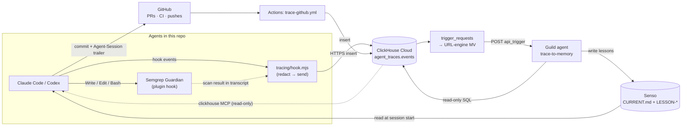

# oct_9

Coding agents (Claude Code, Codex) share one memory in Senso, get security-scanned by Semgrep Guardian, and every action is traced to ClickHouse. A Guild agent turns those traces back into memory.



## How the pieces connect

| Link | Mechanism |
|---|---|
| Agent → Semgrep | Guardian plugin hook scans every file write and blocks on findings |
| Agent → ClickHouse | Hooks in `.claude/settings.json` / `.codex/hooks.json` run `tracing/hook.mjs`: redacts secrets, inserts rows, spools to `.trace/` when offline |
| Semgrep → ClickHouse | Guardian results are read from the Claude transcript and stored as `semgrep_scan` rows, keyed to the tool call |
| GitHub → ClickHouse | `.github/workflows/trace-github.yml` logs PR, CI, and push events; the `Agent-Session:` commit trailer links them to sessions |
| ClickHouse → Guild | Inserting into `agent_traces.trigger_requests` POSTs to the agent's Guild API trigger (`tracing/webhook.sql`) |
| Guild → Senso | `trace-to-memory` queries traces (read-only) and writes `LESSON-*` docs + the `## Lessons` section of `CURRENT.md` |
| Senso → Agents | `AGENTS.md` tells every agent to read `CURRENT.md` at session start |

## Commands

```bash
npm test                 # tracing tests
npm run trace:schema     # create agent_traces.events
npm run trace:webhook    # create the ClickHouse → Guild webhook
```

Trigger the Guild agent manually (any ClickHouse client):

```sql
INSERT INTO agent_traces.trigger_requests (source, text)
VALUES ('manual', 'Run rule lessons-from-failures for the last 24 hours.');
```

Credentials live in `~/.config/oct9/` (`clickhouse.env`, `guild.env`), never in the repo.
