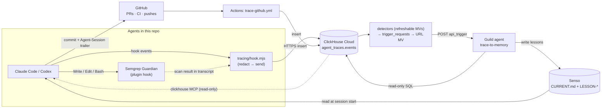

# oct_9

Coding agents (Claude Code, Codex) share one memory in Senso, get security-scanned by Semgrep Guardian, and every action is traced to ClickHouse. A Guild agent turns those traces back into memory.



## How the pieces connect

| Link | Mechanism |
|---|---|
| Agent → Semgrep | Guardian plugin hook scans every file write and blocks on findings |
| Agent → ClickHouse | Hooks in `.claude/settings.json` / `.codex/hooks.json` run `tracing/hook.mjs`: redacts secrets, inserts rows, spools to `.trace/` when offline |
| Semgrep → ClickHouse | Guardian results are read from the Claude transcript and stored as `semgrep_scan` rows, keyed to the tool call |
| GitHub → ClickHouse | `.github/workflows/trace-github.yml` logs PR, CI, and push events; the `Agent-Session:` commit trailer links them to sessions |
| ClickHouse → Guild | Detectors (`tracing/triggers.sql`) append rows to `agent_traces.trigger_requests`; each row is POSTed to the Guild API trigger of the agent named in its `agent` column (`tracing/webhook.sql`) |
| Guild → Senso | `trace-to-memory` queries traces (read-only) and writes `LESSON-*` docs + the `## Lessons` section of `CURRENT.md` |
| Senso → Agents | `AGENTS.md` tells every agent to read `CURRENT.md` at session start |

## ClickHouse: insights and triggers

ClickHouse does the analysis that decides **when** an agent runs and **what** it should look at. Agents get a
precomputed window and summary, so they spend fewer queries.

### Objects (`agent_traces`)

| Object | Engine | Role |
|---|---|---|
| `events` | `ReplacingMergeTree(inserted_at)`, `PARTITION BY toYYYYMM(ts)`, `ORDER BY (repo, session_id, ts, event_id)` | One row per traced event. Re-sent rows (spool retries) share an `event_id` and collapse |
| `trigger_requests` | `MergeTree` | One row = one agent run: `agent`, `dedup_key`, `window_start`/`window_end`, `context` JSON, `text` |
| `detect_*_mv` | Refreshable MV (`REFRESH EVERY … APPEND TO trigger_requests`) | Detectors: re-run a query on a schedule, append new triggers |
| `trigger_requests_mv`, `trigger_requests_<agent>_mv` | Incremental MV, `WHERE agent = '<agent>'` | Fires on each insert into `trigger_requests` and routes the row to that agent's webhook (session-retro also gets `' Context: ' \|\| context` appended to its text) |
| `guild_webhook`, `guild_webhook_<agent>` | `URL(…, JSONEachRow, headers(…))` | An `INSERT` becomes an HTTP POST to Guild (`session_type: api_trigger`). One table per agent, because each Guild API key starts one agent |

Flow: `events` → detector (every 5 min) → `trigger_requests` → incremental MV → URL table → Guild run.
Verified 2026-10-09: rows appended by a refreshable MV do fire the downstream incremental MV.

### Rules every query follows
- **`FROM agent_traces.events FINAL`**: collapses re-sent rows before counting. Without it, counts can double.
- **Detectors are refreshable, not insert-time.** An insert-time MV sees only one `INSERT` block, so it can't
  count across a session, and a spool retry would fire it twice.
- **Dedup:** each detector builds a `dedup_key` (`session_end:<session>:<event_id>`) and skips keys already in
  `trigger_requests` (`HAVING dedup_key NOT IN (SELECT dedup_key FROM agent_traces.trigger_requests …)`).
- **Settle delay:** a detector only considers rows with `inserted_at < now64(3) - INTERVAL 2 MINUTE`, so async
  hook rows for the same session have landed first.
- **Lookback bound:** `inserted_at > now64(3) - INTERVAL 7 DAY` keeps each refresh cheap.
- **Late rows:** filter detectors on `inserted_at` (arrival), not `ts`. Spooled rows arrive later with an old `ts`.
- **Failed tool calls** are `event_type = 'tool_call' AND hook_event = 'PostToolUseFailure'`. They use the same
  type so call counts stay complete.

### Syntax used
| Need | ClickHouse syntax |
|---|---|
| Scheduled detector | `CREATE MATERIALIZED VIEW … REFRESH EVERY 5 MINUTE APPEND TO agent_traces.trigger_requests AS SELECT …` |
| Session segments (a resumed session ends twice) | `lagInFrame(ts, 1, toDateTime64(0, 3, 'UTC')) OVER (PARTITION BY session_id ORDER BY ts …)` |
| Per-session summary | `countIf(...)`, `sumIf(...)`, `anyLast(git_branch)`, `dateDiff('minute', start, end)` |
| Context payload | `toJSONString(map('tool_calls', toString(n), …))` |
| Per-rule Semgrep stats | `ARRAY JOIN semgrep_rules AS rule`, `groupUniqArray(10)(tool_use_id)`, `groupUniqArrayArray(10)(semgrep_files)` |
| Fields inside `payload` | `JSONExtractString(payload, 'conclusion')`, `JSONExtractBool(payload, 'forced')` |
| HTTP out | `ENGINE = URL('https://api.guild.ai/…/sessions', JSONEachRow, headers('Authorization' = 'Basic …'))` |
| Refresh health | `SELECT view, status, last_success_time, exception FROM system.view_refreshes` |

### Triggers

| Detector | Fires when | Agent | Status |
|---|---|---|---|
| `detect_session_end_mv` | a `session_end` with ≥ 5 tool calls in its segment | `session-retro` → PLAYBOOK docs | detector live; agent saved as draft; webhook waits for its key, rows queue in `trigger_requests` |
| volume | a live session passes another N tool calls | `session-retro` | planned |
| thrash | same command / failing goal ≥ 3 times in 10 min | `loop-breaker` | planned |
| PR merged | `github_pr` closed + merged; context = linked sessions' calls since the agent's last run | `workflow-canonizer` → RUNBOOK (proposed) | planned |
| guardrail | new Semgrep finding / CI failure / force-push, debounced to 30 min | `trace-to-memory` → LESSON | planned (manual today) |

Design and decisions: Senso `DESIGN-agent-triggers-V1.md`.

## Commands

```bash
npm test                 # tracing tests
npm run trace:schema     # create agent_traces.events
npm run trace:webhook    # create trigger_requests + the ClickHouse → Guild webhook (recreates the routing MV)
npm run trace:triggers   # create the detector MVs in tracing/triggers.sql
```

Trigger the Guild agent manually (any ClickHouse client):

```sql
INSERT INTO agent_traces.trigger_requests (source, agent, text)
VALUES ('manual', 'trace-to-memory', 'Run rule lessons-from-failures for the last 24 hours.');
```

Credentials live in `~/.config/oct9/` (`clickhouse.env`, `guild.env`), never in the repo. `guild.env` holds
`GUILD_TRIGGER_KEY` (trace-to-memory) and one `GUILD_TRIGGER_KEY_<AGENT>` per other agent (e.g.
`GUILD_TRIGGER_KEY_SESSION_RETRO`). `npm run trace:webhook` skips an agent whose key is missing, together with
every view that writes to its webhook.
